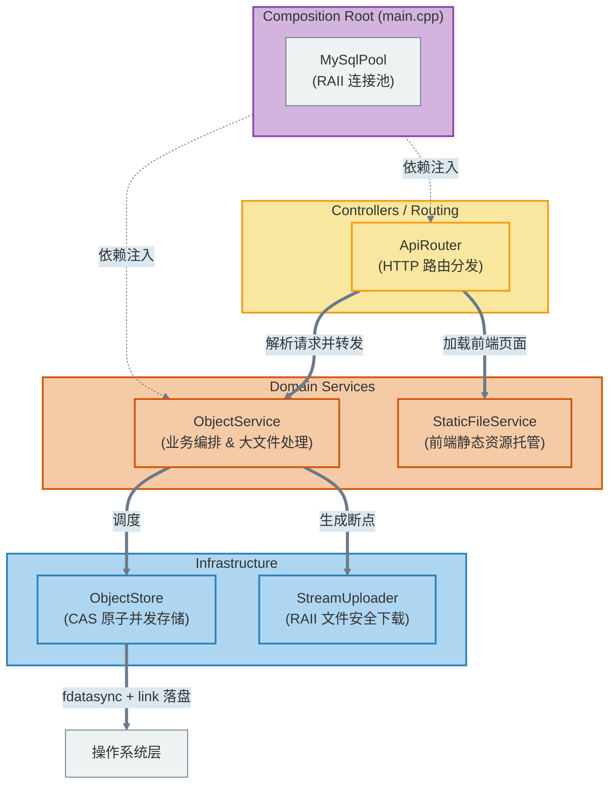

# FileLink ⚡

<p align="center">
  <strong>基于内容寻址的大文件分发与存储平台</strong><br />
  采用 MVC 架构、支持秒传去重与断点续传的现代化 C++ 网盘服务。
</p>

<p align="center">
  
  
  
  
  
</p>

<p align="center">
  <a href="#架构总览">🏗️ 架构总览</a> ·
  <a href="#快速开始">🚀 快速开始</a> ·
  <a href="#核心设计">📚 核心设计</a> 
</p>

> FileLink 旨在解决大体积文件在团队内部的高效流转，采用去重 (Dedup) 技术和 WAL (预写日志) 原子发布协议保证数据的纯洁性。

## 项目亮点 ✨

| 方向 | 当前能力 |
| --- | --- |
| 存储引擎 | 基于 Blake3 的极速哈希计算、严格的 `fdatasync` + `link` CAS 原子发布、多线程无锁复用 |
| 容灾与一致性 | Write-Ahead-Log 落盘协议，彻底防御机器掉电导致的“哈希占位毒化”问题 |
| 数据库接入 | 原生 `libmysqlclient` 封装，提供基于智能指针和条件变量的极简自旋 RAII 连接池 |
| 高并发网络 | 强依赖底层 `Tudou` 框架 (基于 Epoll 的多线程 Reactor 模型) 提供 HTTP 协议接入和路由分发 |
| 工程配套 | 极致优雅的 CMake FetchContent 构建系统、全流程 GTest 测试覆盖、Docker Compose 一键外围部署 |

<a id="快速开始"></a>

## 快速开始 🚀

### 1. 外围依赖部署 (MySQL)

为了保证开发环境的一致性，使用 Docker Compose 启动 MySQL：

```bash
# 复制环境变量模板并填入你的专属密码
cp .env.example .env

# 启动数据库 (无需手工创建数据卷映射目录)
docker compose up -d mysql

# 执行数据库迁移
docker compose run --rm migrate
```

### 2. 编译项目

项目完全采用 CMake 3.25+ 构建，并自动通过 FetchContent 获取一切需要的外部依赖（如 Tudou, CLI11, Blake3, googletest 等），完全不需要满世界找安装包。

```bash
# 生成构建缓存并开启单元测试
cmake -S . -B build -DFILELINK_BUILD_TESTS=ON -DCMAKE_BUILD_TYPE=Release

# 执行并行编译 (-j 后面跟你的 CPU 核心数)
cmake --build build -j4
```

### 3. 运行测试与启动服务

构建完成后可以运行 CTest。当前测试集合仍包含需要 MySQL 的集成测试，后续会将单元测试与集成测试入口分开：

```bash
# 运行单元测试与集成检查
ctest --test-dir build --output-on-failure
```

开发环境统一使用下面的脚本启动。它会加载项目根目录的 `.env`，使用 `config/server.toml`，并把额外参数传给服务：

```bash
./scripts/run-dev

# 临时覆盖端口或连接池大小
./scripts/run-dev --port 8080 --mysql-pool-size 10
```

数据库密码只保存在已被 Git 忽略的 `.env` 中，由启动脚本导出为
`FILELINK_MYSQL_PASSWORD`，不会写入 TOML 或源码。

<a id="架构总览"></a>

## 架构总览 🏗️


*(如果需要阅读文件级物理依赖图，请查看项目生成的最新 `docs/deps_weak.svg` 图像)*

<a id="核心设计"></a>

## 核心设计 📚

如果你打算深入阅读源码、准备相关岗位的面试，或者参与开源贡献，强烈建议先阅读我们留下的这些“硬核”设计文档：

- [存储可靠性与去重设计](./docs/存储可靠性与去重设计-面试宝典.md)：详细解释了如何使用 `link()` 解决并发写入竞争，以及为何必须配合 `fdatasync` 和 `fsync` 的提交协议才能保证机器断电容灾。
- [MySQL 客户端技术选型](./docs/MySQL客户端技术选型.md)：记录了我们为何最终抛弃臃肿的 Connector/C++，坚持使用 `libmysqlclient` 并自行封装极简 RAII 连接池的心路历程。
- [可靠上传 V1 设计](./docs/可靠上传V1设计.md)：旧版架构和设计的梳理，用作后续 V2 大重构的对比。
