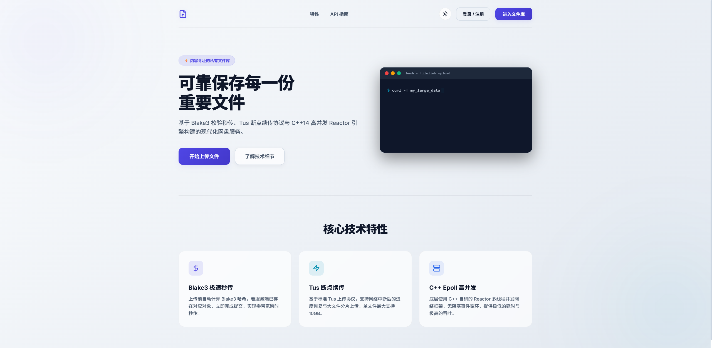

# FileLink ⚡

<p align="center">
  <strong>基于内容寻址的大文件存储与分享平台</strong><br />
  采用分层模块化架构，支持秒传去重、分片上传与断点续传的 C++ 文件服务。
</p>

<p align="center">
  
  
  
  
  
</p>

<p align="center">
  <a href="#架构总览">🏗️ 架构总览</a> ·
  <a href="#快速开始">🚀 快速开始</a> ·
  <a href="#核心设计">📚 核心设计</a> 
</p>

> FileLink 面向团队内部的大体积文件流转，使用 `File / Object` 两层模型实现跨用户内容去重，并通过 `fdatasync + link` 原子发布协议保证对象完整性。

## 项目亮点 ✨


| 方向         | 当前能力                                                                             |
| -------------- | -------------------------------------------------------------------------------------- |
| 存储引擎     | 基于 BLAKE3 的流式哈希、`fdatasync + link` CAS 原子发布、相同内容的并发复用          |
| 上传链路     | 基于 TUS 的分片上传、偏移续传、异步完成状态机及上传取消竞态保护                      |
| 容灾与一致性 | 对象引用计数、待回收状态、过期上传清理及孤儿对象扫描，在线请求与离线维护职责分离     |
| 数据库接入   | 使用 SOCI 管理 SQL 绑定、事务和连接池，底层通过官方 `libmysqlclient` 连接 MySQL      |
| 高并发网络   | 基于 Epoll 多线程 Reactor 的 `Tudou` HTTP 服务，路由、业务服务与存储层分离           |
| 工程配套     | CMake 构建、GoogleTest 单元/集成测试、Shell HTTP 检查、Docker Compose 与 dbmate 迁移 |

## 使用场景

用户登录后可以上传和管理私有文件，也可以为指定文件创建带过期时间的公开分享链接。相同内容被不同用户上传时，系统只保留一份物理对象，同时为每位用户维护独立的逻辑文件记录。

## 页面预览 🖼️



<a id="快速开始"></a>

## 快速开始 🚀

### 1. 外围依赖部署 (MySQL)

为了保证开发环境的一致性，使用 Docker Compose 启动 MySQL：

```bash
# 复制环境变量模板并填入你的专属密码
cp .env.example .env

# 启动数据库 (无需手工创建数据卷映射目录)
docker compose up -d mysql

# 执行数据库迁移
docker compose run --rm migrate
```

### 2. 编译项目

项目使用 CMake 3.25+ 构建。Tudou、CLI11、BLAKE3 和 GoogleTest 优先使用系统安装版本，缺失时由 `FetchContent` 获取；MySQL client、libsodium 和 hiredis 需要通过系统开发包提供。

```bash
# 生成构建缓存并开启单元测试
cmake -S . -B build -DFILELINK_BUILD_TESTS=ON -DCMAKE_BUILD_TYPE=Release

# 执行并行编译 (-j 后面跟你的 CPU 核心数)
cmake --build build -j4
```

### 3. 运行测试与启动服务

默认构建的单元测试不连接 MySQL 服务，也不需要运行 MySQL 容器：

```bash
ctest --test-dir build -L unit --output-on-failure
```

数据库和服务进程测试需要显式开启，并使用独立的测试环境变量：

```bash
cmake -S . -B build \
    -DFILELINK_BUILD_TESTS=ON \
    -DFILELINK_BUILD_INTEGRATION_TESTS=ON
cmake --build build -j4

FILELINK_TEST_MYSQL_PASSWORD=your-password \
    ctest --test-dir build -L integration --output-on-failure
```

开发环境统一使用下面的脚本启动。它会加载项目根目录的 `.env`，使用 `config/server.toml`，并把额外参数传给服务：

```bash
./scripts/run-dev.sh

# 临时覆盖端口或连接池大小
./scripts/run-dev.sh --port 8080 --mysql-pool-size 10
```

数据库密码只保存在已被 Git 忽略的 `.env` 中，由启动脚本导出为
`FILELINK_MYSQL_PASSWORD`，不会写入 TOML 或源码。

<a id="架构总览"></a>

## 架构总览 🏗️


<a id="核心设计"></a>

## 核心设计 📚

- [项目总览与模块地图](./docs/项目总览与模块地图.md)：从组合根、模块职责和数据边界了解整体架构。
- [分片上传与断点续传](./docs/Uploads：分片上传与断点续传设计.md)：说明 TUS 会话、异步完成和取消竞态的处理方式。
- [内容寻址与物理存储](./docs/Storage：内容寻址与物理存储设计.md)：说明 BLAKE3、对象发布、去重和引用计数。
- [对象回收与离线维护](./docs/Cleaner：对象回收与离线维护设计.md)：说明过期上传、待回收对象和孤儿文件的维护流程。
- [数据库访问层与 SOCI 集成](./docs/Database：数据访问层 DAO 与 SOCI 集成.md)：说明 DAO、事务和连接池的组织方式。

如果需要阅读文件级物理依赖图，请查看 [`docs/archive/deps_weak.svg`](./docs/archive/deps_weak.svg)。
