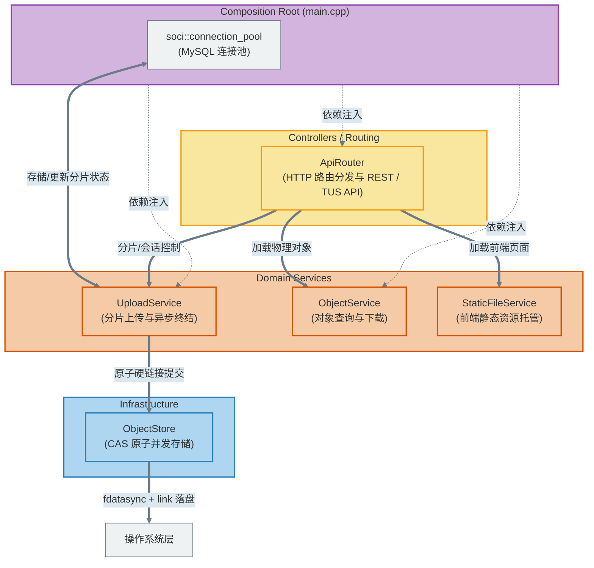

# FileLink ⚡

<p align="center">
  <strong>基于内容寻址的大文件分发与存储平台</strong><br />
  采用 MVC 架构、支持秒传去重与断点续传的现代化 C++ 网盘服务。
</p>

<p align="center">
  
  
  
  
  
</p>

<p align="center">
  <a href="#架构总览">🏗️ 架构总览</a> ·
  <a href="#快速开始">🚀 快速开始</a> ·
  <a href="#核心设计">📚 核心设计</a> 
</p>

> FileLink 旨在解决大体积文件在团队内部的高效流转，采用去重 (Dedup) 技术和基于硬链接 (link/unlink) 的原子发布协议保证数据的完整性。

## 项目亮点 ✨


| 方向         | 当前能力                                                                                      |
| -------------- | ----------------------------------------------------------------------------------------------- |
| 存储引擎     | 基于 Blake3 的极速哈希计算、严格的`fdatasync` + `link` CAS 原子发布、多线程无锁复用           |
| 容灾与一致性 | 基于内容寻址的对象提交、哈希一致性校验及临时文件安全清理机制，确保发布完整性                  |
| 数据库接入   | 使用 SOCI 管理 SQL 绑定、事务和连接池，底层通过官方`libmysqlclient` 连接 MySQL                |
| 高并发网络   | 强依赖底层`Tudou` 框架 (基于 Epoll 的多线程 Reactor 模型) 提供 HTTP 协议接入和路由分发        |
| 工程配套     | 极致优雅的 CMake FetchContent 构建系统、GTest 单元测试与集成测试、Docker Compose 一键外围部署 |

<a id="快速开始"></a>

## 快速开始 🚀

### 1. 外围依赖部署 (MySQL)

为了保证开发环境的一致性，使用 Docker Compose 启动 MySQL：

```bash
# 复制环境变量模板并填入你的专属密码
cp .env.example .env

# 启动数据库 (无需手工创建数据卷映射目录)
docker compose up -d mysql

# 执行数据库迁移
docker compose run --rm migrate
```

### 2. 编译项目

项目完全采用 CMake 3.25+ 构建，并自动通过 FetchContent 获取一切需要的外部依赖（如 Tudou, CLI11, Blake3, googletest 等），完全不需要满世界找安装包。

```bash
# 生成构建缓存并开启单元测试
cmake -S . -B build -DFILELINK_BUILD_TESTS=ON -DCMAKE_BUILD_TYPE=Release

# 执行并行编译 (-j 后面跟你的 CPU 核心数)
cmake --build build -j4
```

### 3. 运行测试与启动服务

默认只构建不依赖 MySQL 的单元测试：

```bash
ctest --test-dir build -L unit --output-on-failure
```

数据库和服务进程测试需要显式开启，并使用独立的测试环境变量：

```bash
cmake -S . -B build \
    -DFILELINK_BUILD_TESTS=ON \
    -DFILELINK_BUILD_INTEGRATION_TESTS=ON
cmake --build build -j4

FILELINK_TEST_MYSQL_PASSWORD=your-password \
    ctest --test-dir build -L integration --output-on-failure
```

开发环境统一使用下面的脚本启动。它会加载项目根目录的 `.env`，使用 `config/server.toml`，并把额外参数传给服务：

```bash
./scripts/run-dev.sh

# 临时覆盖端口或连接池大小
./scripts/run-dev.sh --port 8080 --mysql-pool-size 10
```

数据库密码只保存在已被 Git 忽略的 `.env` 中，由启动脚本导出为
`FILELINK_MYSQL_PASSWORD`，不会写入 TOML 或源码。

<a id="架构总览"></a>

## 架构总览 🏗️



*(如果需要阅读文件级物理依赖图，请查看项目生成的最新 `docs/deps_weak.svg` 图像)*

<a id="核心设计"></a>

## 核心设计 📚

如果你打算深入阅读源码、准备相关岗位的面试，或者参与开源贡献，强烈建议阅读以下核心设计文档：

- [硬链接原子发布原理](./docs/为什么使用link-unlink原子发布.md)：详细解释了如何使用 `link()` 解决并发写入竞争，确保 CAS (内容寻址) 系统的提交原子性。
- [为什么选择 SOCI](./docs/Q：为什么选择%20SOCI.md)：说明为何选择使用 SOCI 来管理连接生命周期、连接池和 C++ 风格的 SQL 绑定。
- [服务层拆分设计](./docs/服务层拆分设计.md)：详细拆分核心逻辑，使存储、下载与分片上传高内聚低耦合。
- [轻量级文件扩展名保留方案](./docs/轻量级文件扩展名保留方案.md)：说明系统在去重存储的同时，如何保留文件后缀名以支持浏览器正确预览。
- [历史设计文档存档](./docs/archive/)：包含了早期的 MVP 设计记录、断点续传选型以及 V1 架构演进文档以供对比参考。
