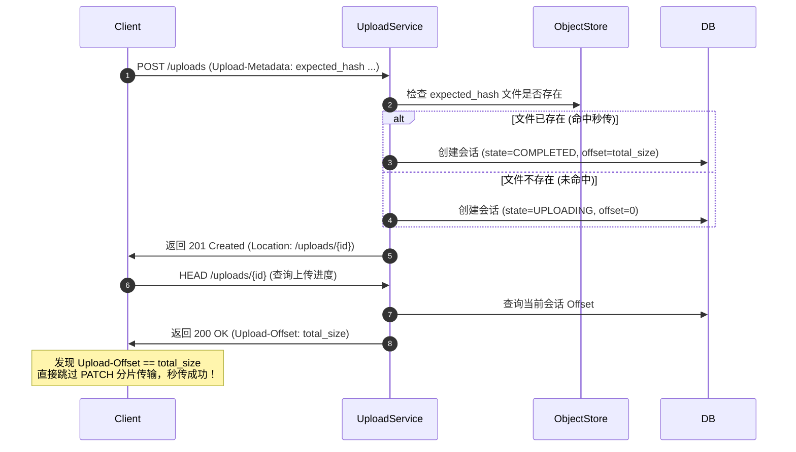

# 流式 Hash 计算与秒传设计方案

为了优化大文件上传表现，降低服务器磁盘 I/O 压力并提升用户体验，本项目针对分片上传设计并实现了两大优化机制：**流式计算 Hash** 和 **哈希秒传 (Instant Upload / Deduplication)**。

---

## 1. 流式 Hash 计算设计

### 1.1 改造背景与现状 (As-Is)
在优化前，分片上传的 Hash 校验是在整个文件上传结束后进行的：
1. 客户端通过 `PATCH` 逐个分片追加写入 `.part` 临时文件。
2. 最后一个分片上传成功且偏移量达到 `total_size` 后，服务端启动一个后台异步线程调用 `finalize_session`。
3. `finalize_session` 在磁盘上重新打开刚才生成的 `.part` 临时文件，并通过 Buffer 从头到尾读取整个文件来计算最终的 BLAKE3 Hash。
4. 将计算出的 Hash 与客户端期望的 Hash 校验对比。

**痛点**：
对于大文件，重新读取和计算 Hash 耗时长，会导致严重的**二次磁盘 I/O 尖峰**，且会话在 `FINALIZING` 状态滞留过久，使得调用方无法立刻查询/下载该文件。

### 1.2 方案选型：内存 Hasher 缓存 + 延迟重建 (Lazy Reconstruction)
我们对比了内存缓存方案与数据库序列化方案，最终采用了 **内存 Hasher 缓存** 方案：
* **正常路径（流式更新）**：在 `UploadService` 中维护一个线程安全的内存 Map (`activeHashers_`)。每一个 chunk 写入后，直接在内存中调用 `blake3_hasher_update` 更新，**无额外磁盘读取开销**。
* **恢复路径（延迟重建）**：若发生服务重启、会话超时被清理或请求路由到其他实例，导致在 Map 中找不到对应的 Hasher，则重新打开磁盘上的 `.part` 文件，从头读取 `0` 到 `clientOffset` 范围的数据更新新初始化的 Hasher 以恢复状态，再追加当前分片数据。
* **异常回退**：若状态发生不匹配，或者流式计算失败，在最终 `finalize_session` 时回退到重读文件重新计算的保底逻辑。

### 1.3 核心实现代码
在 [UploadService.h](file:///home/wxm/FileLink/src/UploadService.h) 中定义了缓存结构和管理成员：
```cpp
struct ActiveHasher {
    blake3_hasher hasher;
    uint64_t current_offset = 0;
    std::chrono::steady_clock::time_point last_active;
};

// 私有成员：
std::unordered_map<std::string, ActiveHasher> activeHashers_;
std::mutex hashersMutex_;
```

---

## 2. 哈希秒传机制 (Instant Upload / Deduplication) 设计

秒传的本质是：在客户端发起上传请求时，如果服务端检测到该文件内容已经存在于对象库中，则直接跳过文件传输，瞬间完成上传。

### 2.1 秒传交互原理
秒传机制通过扩展已有的 Tus 可恢复上传协议工作流实现，对客户端极其友好且 100% 兼容：
1. **POST 创建会话**：客户端发送 `POST /uploads`，并在 `Upload-Metadata` 头中携带文件哈希 `expected_hash` (以 Base64 编码)。
2. **秒传匹配校验**：服务端解析哈希值，通过 `ObjectStore` 判断此哈希对应的文件是否已经在磁盘中存在。
3. **完成会话创建**：
   * **未命中秒传**：按常规流程创建 `UPLOADING` 状态的会话，偏移量设为 `0`。
   * **命中秒传**：直接将该会话在数据库中的状态设置为 `COMPLETED`，`content_hash` 设为客户端传入的哈希，且 `committed_offset` 置为文件总大小 `total_size`。
4. **HEAD 查询响应**：客户端接收到成功响应后，按照 Tus 规范发送 `HEAD /uploads/{id}` 来查询已上传的偏移量（Offset）。此时服务端返回 `Upload-Offset: <total_size>`。客户端发现 Offset 已经等于 Length，得知文件已秒传成功，无需再发送任何 `PATCH` 请求，秒传流程结束。



### 2.2 秒传决策核心代码
在 [UploadService.cpp](file:///home/wxm/FileLink/src/UploadService.cpp#L163) 的 `create_session` 方法中：
```cpp
    bool hitDeduplication = false;
    std::string hashBytes;
    if (expectedHash.size() == 64) {
        // 1. 将 16 进制 Hash 字符串转换为二进制
        for (std::size_t i = 0; i < 64; i += 2) {
            char high = expectedHash[i];
            char low = expectedHash[i + 1];
            int h = (high >= 'a') ? (high - 'a' + 10) : ((high >= 'A') ? (high - 'A' + 10) : (high - '0'));
            int l = (low >= 'a') ? (low - 'a' + 10) : ((low >= 'A') ? (low - 'A' + 10) : (low - '0'));
            hashBytes.push_back(static_cast<char>((h << 4) | l));
        }

        // 2. 检查 ObjectStore 中文件是否存在
        std::string objectPath = store_.get_object_path(expectedHash);
        struct stat st;
        if (::stat(objectPath.c_str(), &st) == 0 && S_ISREG(st.st_mode)) {
            hitDeduplication = true;
        }
    }

    // 3. 组装会话
    db::UploadSession session;
    session.upload_id = uploadIdBinary;
    session.file_name = filename.empty() ? ("upload_" + out_uploadIdHex + ".bin") : filename;
    session.total_size = totalSize;

    if (hitDeduplication) {
        // 直接归档为已完成状态
        session.state = "COMPLETED";
        session.committed_offset = totalSize;
        session.expected_hash = hashBytes;
        session.has_expected_hash = true;
        session.content_hash = hashBytes;
        session.has_content_hash = true;
    } else {
        session.state = "UPLOADING";
        session.committed_offset = 0;
        // ... (正常未命中的初始化逻辑) ...
    }
```

### 2.3 测试方法
我们在集成测试 [TusControlApiTest.cpp](file:///home/wxm/FileLink/tests/TusControlApiTest.cpp) 中补充了测试用例 `TusDatabaseApiTest.PostDeduplicationInstantlyCompletes` 来进行回归保障，防止改动破坏秒传的机制逻辑。
