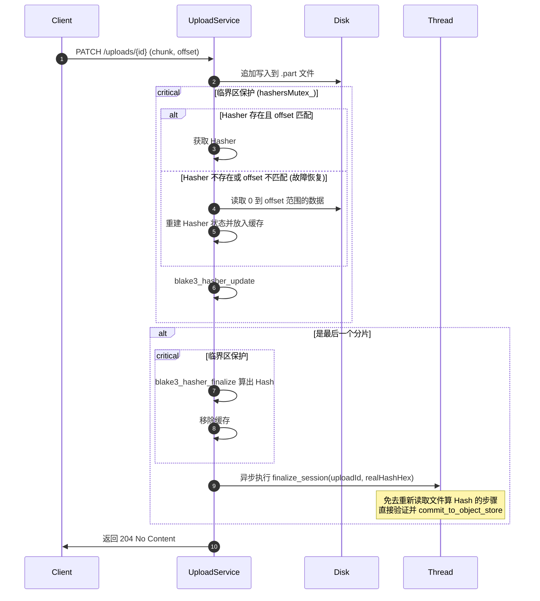

# 流式 Hash 计算设计方案

为了优化大文件上传结束后的系统表现，避免在上传完成后对大文件进行“整只”重新读取以计算 Hash，本项目决定引入**流式上传过程中同时计算 Hash** 的机制。本文档记录了现有的 Hash 计算设计、改造的必要性、不同设计方案的对比分析，以及最终决定采用的方案 A（内存 Hasher 缓存 + 延迟重建）的详细设计方案。

---

## 1. 现有设计与改造背景

### 1.1 现有设计 (As-Is)

在现有的 [UploadService.cpp](file:///home/wxm/FileLink/src/UploadService.cpp) 实现中，分片上传的 Hash 校验是在整个文件上传结束后进行的：

1. 客户端通过 `PATCH` 分片追加写入 `.part` 临时文件。
2. 最后一个分片上传成功且偏移量达到 `total_size` 后，服务端启动一个后台异步线程调用 [finalize_session](file:///home/wxm/FileLink/src/UploadService.cpp#L244)。
3. [finalize_session](file:///home/wxm/FileLink/src/UploadService.cpp#L244) 会在磁盘上重新打开刚才生成的 `.part` 临时文件，并通过 Buffer（每次 64KB）从头到尾读取整个文件来计算最终的 BLAKE3 Hash。
4. 将计算出的 Hash 与客户端期望的 Hash 校验对比，通过后提交到 ObjectStore 并标记会话完成。

### 1.2 为什么做流式 Hash 计算？(Why)

虽然异步线程避免了直接阻塞最后一个 HTTP 响应，但随着文件大小增加，上述设计暴露出两个明显的瓶颈：

* **二次磁盘 I/O 尖峰**：如果上传一个 10GB 的大文件，上传完成后需要再次读取 10GB 磁盘数据。这会导致磁盘 I/O 出现极大尖峰，降低服务器的整体并发吞吐量。
* **延迟终结 (Finalization Latency)**：对于大文件，重新读取和计算 Hash 耗时长，导致会话状态在 `FINALIZING` 状态滞留过久，使得调用方或客户端无法立刻查询/下载该文件。

如果在接收分片数据的同时，将数据块同步更新给 BLAKE3 Hasher，在最后一个分片写入完成时，我们可以在常数时间（< 1ms）内计算出 Hash。

---

## 2. 方案对比与选型

由于 Tus 协议支持断点续传（即客户端可以在任意时间中断上传，并在以后恢复），且服务可能发生重启或在多实例下运行，流式 Hasher 的状态必须具备恢复能力。我们对比了以下两种方案：

### 2.1 方案 A：内存 Hasher 缓存 + 延迟重建 (Lazy Reconstruction) - **最终选择**

* **基本原理**：
  * 在 `UploadService` 中维护一个线程安全的内存 Map 缓存活跃的 Hasher 状态（包含 `blake3_hasher` 结构体、当前 offset 和最后活跃时间）。
  * 正常上传分片时，直接从内存中获取 Hasher 并追加计算，**无额外磁盘读取开销**。
  * 若发生服务重启、会话超时被清理或请求路由到其他服务器实例，导致在 Map 中找不到对应的 Hasher，则触发**延迟重建 (Lazy Reconstruction)**：从磁盘的 `.part` 文件中读取 `0` 到 `clientOffset` 范围的数据，喂给重新初始化的 Hasher 以恢复状态，再追加当前分片数据。
* **对比评估**：
  * **优点**：**开发成本低**，不需要修改数据库 Schema，不修改 migration，只在 `UploadService` 内部处理。对于正常上传，100% 消除二次 I/O。
  * **缺点**：如果发生了服务重启后的第一笔分片续传请求，会多一次 partial-read 磁盘 I/O 来恢复 Hasher。但这是**低频故障恢复路径**，性能损失是完全可接受的。

### 2.2 方案 B：将 Hasher 状态序列化存入数据库

* **基本原理**：
  * BLAKE3 的 `blake3_hasher` 是一个无指针的 POD (Plain Old Data) 结构体，大小固定（约 1.1 KB 左右）。
  * 在每次更新 `committed_offset` 的数据库事务中，将 `blake3_hasher` 的内存拷贝作为 `BLOB` / `VARBINARY` 写入 MySQL 的 `upload_sessions` 表。
  * 每次分片到达时，先从数据库取出该二进制数据，还原到 `blake3_hasher` 结构体中，更新后再序列化写回数据库。
* **对比评估**：
  * **优点**：完全无状态，天然支持水平扩展，不怕任何服务重启，不需要任何 I/O 回退。
  * **缺点**：**开发成本中偏高**。需要修改 MySQL Schema，写 SQL migration，并修改 `db::UploadSession` 结构体和 DAO。此外，由于每次写入分片都需要读写 1.1 KB 的数据库 BLOB，可能会轻微增加数据库的事务和写负载，并不适合高并发的小 chunk 写入。

### 2.3 选型理由

本项目决定采用 **方案 A**：

1. **极佳的性能上限**：正常上传路径下完全零 I/O 读开销；仅在低频异常（服务重启/断点后续传）时回退到 I/O 重建，且即使在多实例下，重建也能自愈，具有极强的鲁棒性。如果采用方案 B 对小 chunk 而言会增加数据库写负担。
2. **轻量与易维护**：在当前的单实例架构下，方案 A 的开发复杂度较低，不影响现有数据库的演进，更符合增量重构（Incremental Development）的原则。

---

## 3. 方案 A 详细设计 (To-Be)

### 3.1 核心数据结构

在 [UploadService.h](file:///home/wxm/FileLink/src/UploadService.h) 中引入 `ActiveHasher` 结构体：

```cpp
struct ActiveHasher {
    blake3_hasher hasher;
    uint64_t current_offset = 0;
    std::chrono::steady_clock::time_point last_active;
};
```

在 `UploadService` 私有成员中加入 Hasher 缓存及互斥锁：

```cpp
std::unordered_map<std::string, ActiveHasher> activeHashers_;
std::mutex hashersMutex_;
```

### 3.2 写入与更新流程

当调用 [write_session_chunk](file:///home/wxm/FileLink/src/UploadService.cpp#L198) 追加写入磁盘成功后：

1. **加锁获取/重建 Hasher**：
   * 在临界区内，通过 `uploadIdHex` 查找 `activeHashers_`。
   * 如果缓存存在且 `current_offset == clientOffset`，直接获取使用。
   * 如果缓存不存在，或者 offset 不匹配（例如客户端发生重试）：
     * 释放锁（以避免在 I/O 时阻塞其他会话）。
     * 执行延迟重建：调用辅助函数，打开磁盘上的 `.part` 文件，从头读取到 `clientOffset` 大小的数据更新新初始化的 Hasher。
     * 重新获取锁，将重建后的 Hasher 插入到 `activeHashers_` 中。
2. **更新 Hasher 状态**：
   * 调用 `blake3_hasher_update(&activeHasher.hasher, chunkData.data(), chunkData.size())` 更新状态。
   * 更新 `current_offset += chunkData.size()`，并刷新 `last_active = now()`。
3. **完成上传与终结**：
   * 如果写入后 `newOffset == total_size`，即文件已上传完毕，在临界区内直接对对应的 Hasher 调用 `blake3_hasher_finalize`，计算出 `realHashHex`。
   * 将该 session 从 `activeHashers_` 中擦除。
   * 启动后台线程时，不再调用无参的 `finalize_session(uploadIdHex)`，而是调用带 Hash 值的重载版本 `finalize_session(uploadIdHex, realHashHex)`。



### 3.3 容错与平滑回退 (Fallback)

* **重建失败处理**：如果在延迟重建时，因为读取文件异常等原因失败，不影响文件的持续追加。我们会主动清理该 session 的内存 Hasher 缓存。
* **终结回退**：在后台线程执行 `finalize_session(uploadIdHex, realHashHex)` 时，如果发现传入的 `realHashHex` 为空（由于重建失败、计算异常或其它降级场景），会**平滑回退**到原始的 `compute_file_hash` 逻辑，即从头重新读取一次 `.part` 文件并计算 Hash。这确保了无论流式状态发生何种异常，数据的完整性校验永远不会失效。

```scheme
Feat：从上传完成后读取整个文件进行 hash，优化为上传过程中同步进行流式 hash，当内存 Hasher 丢失（如服务重启或分片乱序）时，使用延迟重建 (Lazy Reconstruction) 机制，从磁盘  .part  已上传部分中重建 Hasher 状态；若  realHashHex  未能成功计算（为  "" ），后台线程 UploadService.cpp 会降级为从头重读文件重新计算
Hash，实现了平滑回退 (Fallback)，确保业务高可用。
```

### 3.4 内存防泄露与清理机制

为了防止因为客户端放弃上传而导致内存中的 `activeHashers_` 持续增长，有两种应对策略：

1. **定期清理任务**：在 `UploadService` 中提供定时清理任务（由后台清理线程或服务本身定时触发），遍历 `activeHashers_`，将 `now() - last_active` 超过设定阈值（如 1 小时）的 Hasher 擦除。因为有 Lazy Reconstruction 机制，即使由于超时被误删，客户端下次续传时也能自动重建，不会引发逻辑错误。
2. **跟随过期策略**：随着可靠上传会话的 Expire 清理，一并联动触发内存 Hasher 的擦除。
