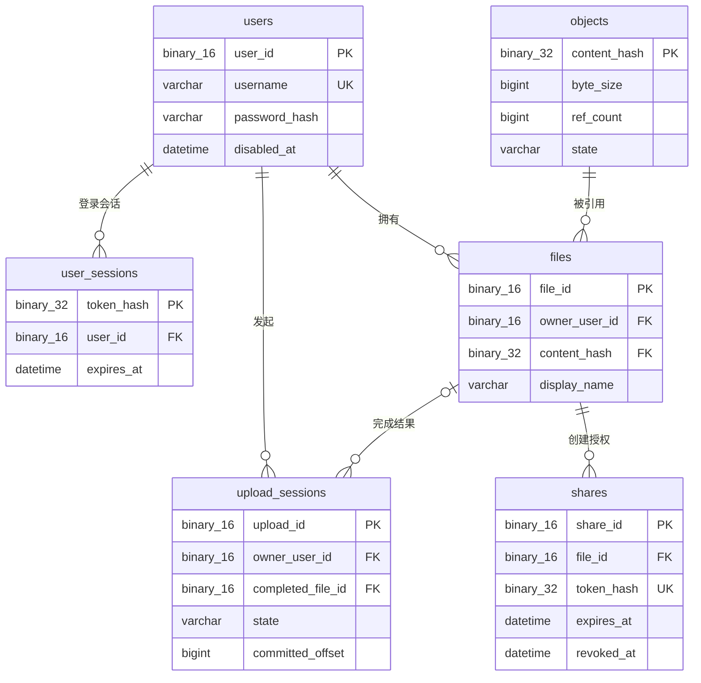

# 核心数据模型与一致性

本项目最重要的理解方式是：**数据库不是“记录上传日志”的地方，而是定义文件所有权、访问权限和存储生命周期的事实来源。**

不要把浏览器里的一个文件、磁盘上的一串字节和一次上传请求当成同一个东西。FileLink 将它们拆开建模，分别解决权限、去重和不可靠网络的问题。

## 先建立一张心智图

```text
User ──拥有──► File ──引用──► Object ──对应──► 磁盘对象字节
  │              │
  │              └──被授权给──► Share ──► 公开下载
  │
  └──拥有──► UserSession
  │
  └──拥有──► UploadSession ──完成后──► File
```

其中 `File` 是整个业务模型的中心：它既属于一个用户，又引用一个内容对象。没有 `File`，即使磁盘上存在 Object，也没有任何用户在业务上“拥有”它。

## 表关系图



读图时先沿粗主线理解：`users → files → objects`。`user_sessions` 解决登录，`upload_sessions` 解决尚未完成的传输，`shares` 则为已有 File 增加临时公开授权。`completed_file_id` 是可空字段：一个上传会话只有成功完成后才关联 File，因此图中不是必然关系。

## 三类数据，各自回答不同问题


| 数据       | 保存位置     | 回答的问题                               | 是否真相来源     |
| ------------ | -------------- | ------------------------------------------ | ------------------ |
| 业务元数据 | MySQL        | 谁拥有文件、对象被引用几次、分享是否有效 | 是               |
| 文件字节   | 本地对象存储 | 实际应下载的内容在哪里                   | 是，但不负责权限 |
| 会话加速项 | Redis        | 这个令牌最近是否对应某个用户             | 否，可丢失       |

MySQL 的初始结构在 [`database/migrations/202607130001_initial_schema.sql`](../database/migrations/202607130001_initial_schema.sql)。磁盘文件由 `ObjectStore` 按内容哈希定位；Redis 仅缓存 `token_hash → user_id`，失效或不可用时仍回查 MySQL。

## 六张表分别做什么

### `users`：账户身份

`users` 是所有归属关系的起点。`user_id` 是内部二进制 UUID；`username` 唯一；`password_hash` 只保存 Argon2id 密码哈希。`disabled_at` 不删除账户，而是让该用户不能再通过认证。

它不保存“用户文件列表”。文件列表来自 `files.owner_user_id` 的查询。

### `user_sessions`：可撤销的登录凭据

浏览器 Cookie 中是原始随机令牌；数据库只保存其 libsodium 通用哈希（BLAKE2b）`token_hash`。一个用户可以有多行会话，也就是可以同时在多台设备登录。认证时令牌被再次哈希，再查询未过期且对应的用户未被禁用的会话。

这张表的意义是：服务器可以按条删除会话实现登出，而不必把密码或原始令牌存入数据库。

### `objects`：唯一的物理内容

一行 `objects` 代表一个由 `content_hash` 唯一标识的、不可变的字节序列。它不是“某个用户的文件”，不带文件名和所有者。

- `byte_size`：对象的真实大小。
- `ref_count`：引用它的逻辑 File 数量，由应用事务维护。
- `state`：`READY`、`PENDING_DELETE` 或 `RECLAIMING`，用于安全离线回收。

相同内容只应有一个 Object，但可以有多个 File。例如 Alice 和 Bob 都上传内容相同的 `report.pdf`，最终是两个 File 指向同一个 Object，`ref_count = 2`。

### `files`：用户真正看到的文件

`files` 是“我的文件”列表里的每一项：`owner_user_id` 表示归属，`display_name` 表示用户看到的名字，`content_hash` 指向 Object。它将权限语义和字节存储解耦：同一内容可以在不同用户的列表中用不同文件名出现。

`(owner_user_id, created_at)` 索引服务于“按创建时间倒序列出我的文件”；下载、删除都用 `file_id + owner_user_id` 查询。因此非所有者被当作不存在并返回 `404`，不泄露文件是否存在。

### `shares`：对 File 的临时公开授权

Share 不是对 Object 的公开地址，而是一条针对单个 File 的授权记录。它有独立的随机 token，其哈希存入 `token_hash`；原始 token 仅在创建成功时返回给客户端。公开下载时检查 token 是否匹配、是否过期、是否已撤销。

`shares.file_id` 使用 `ON DELETE CASCADE`：删除 File 时，其所有分享记录也自动消失。这个选择说明分享不能脱离逻辑文件而独立存在。

### `upload_sessions`：尚未完成的传输过程

UploadSession 解决的是不可靠网络，不是最终文件本身。它记录上传者、文件名、总大小、已提交偏移量、可选的预期哈希和过期时间；临时分片文件在磁盘 `uploads/` 下。

成功后，`content_hash` 记录实际内容，`completed_file_id` 指向创建出的 File。失败、取消和过期的会话都不会产生可下载的 File。换句话说：

```text
UploadSession = “这次传输进展如何”
File          = “用户现在拥有什么”
Object        = “字节实际存在哪里”
```

## 两个最关键的事务

### 上传完成：先发布字节，再建立业务引用

```text
UPLOADING → FINALIZING
  │
  ├─ 校验流式计算出的 BLAKE3 哈希
  ├─ ObjectStore 原子发布临时文件，或复用已有 Object
  │
  └─ MySQL 单个事务：
       1. 为 Object 创建/增加引用（ref_count + 1）
       2. 创建归属当前用户的 File
       3. UploadSession → COMPLETED，写入 content_hash 与 completed_file_id
```

物理对象必须先发布，避免数据库已指向一个不存在的下载文件；而 File、Object 引用和完成状态必须在同一事务提交，避免“文件存在但引用数未加”或“会话完成却没有 File”。

这里仍有一个刻意接受的崩溃窗口：对象字节发布成功后、数据库事务提交前若进程崩溃，磁盘可能留下没有 `objects` 记录的文件。`ObjectOrphanReclaimer` 负责离线发现和回收它；这比在请求路径中进行昂贵扫描更安全。

### 删除文件：先取消业务所有权，再延后删除字节

```text
MySQL 单个事务：
  1. 按 file_id + owner_user_id 找到 File
  2. 删除该 File（关联 Share 由外键级联删除）
  3. Object.ref_count - 1
     └─ 减到 0：Object.state = PENDING_DELETE
```

此时磁盘字节不会立即删除。后台 `ObjectReclaimer` 只处理零引用且待回收的 Object：先声明 `RECLAIMING`，删除磁盘文件，再删除数据库记录；若磁盘操作失败则回退为 `PENDING_DELETE`。这样 HTTP 删除请求快，且不会因中途失败留下“数据库已删、无法重试”的状态。

## 状态机与不变量

### UploadSession 状态

```text
UPLOADING → FINALIZING → COMPLETED
     │           │
     ├──────────► FAILED
     ├──────────► ABORTED
     └──────────► EXPIRED
```

`FINALIZING` 表示分片已收齐、正在发布对象和创建 File；此时拒绝取消，以避免取消与完成同时修改同一会话。`ABORTED` 与 `EXPIRED` 都是逻辑终态：后续 PATCH 被拒绝，`UploadSessionCleaner` 会异步删除 `.part`；删除成功或文件已不存在后再删除会话记录。数据库约束保证 `committed_offset ≤ total_size`，并要求 `COMPLETED` 会话必须拥有 `content_hash`。

### Object 状态

```text
READY ──最后一个 File 被删除──► PENDING_DELETE
                                      │
                                  回收器认领
                                      ▼
                                RECLAIMING ──成功──► 删除记录和字节
                                      │
                                  磁盘删除失败
                                      ▼
                                PENDING_DELETE
```

需要记住的三个不变量：

1. 每个 File 必须引用存在的 User 和 Object（外键保证）。
2. `ref_count` 应等于引用该 Object 的 File 数量；这是由上传完成、删除 File 的事务维护的业务不变量。
3. 原始密码、会话令牌和分享 token 都不落 MySQL；数据库只保存不可直接使用的哈希。

## 用一个例子串起全链路

Alice 上传 `毕业设计.pdf`，内容哈希为 `H`：

1. 系统创建 Alice 的 UploadSession，浏览器从偏移量 0 开始分片上传。
2. 上传结束后，临时文件被发布为 `Object(H)`；若 Bob 以前上传过同内容，则这一步直接复用已有字节。
3. 事务创建 `File(F1, Alice, H, "毕业设计.pdf")`，Object 的引用数变为 1（或在已有基础上加一）。
4. Alice 创建分享，得到 `Share(S1, F1, token_hash)`；访问者凭原始 token 下载的是 F1 对应的 Object。
5. Alice 删除 F1。S1 级联删除；Object 的引用数减一。若 Bob 仍有引用，Object 保持 `READY`；若没有引用，则进入 `PENDING_DELETE`，等待离线回收。

这个例子解释了为什么“去重”不破坏权限：共享的是不可变字节，绝不共享用户的 File 所有权或分享授权。

## 阅读代码时的落点

- 表和约束：[`database/migrations/202607130001_initial_schema.sql`](../database/migrations/202607130001_initial_schema.sql)
- 数据模型与 SQL：`src/database/{User,UserSession,Object,File,Share,UploadSession}.{h,cpp}`
- 上传完成事务：[`src/uploads/UploadService.cpp`](../src/uploads/UploadService.cpp)
- 文件删除事务：[`src/files/FileService.cpp`](../src/files/FileService.cpp)
- 待回收对象处理：[`src/cleaner/ObjectReclaimer.cpp`](../src/cleaner/ObjectReclaimer.cpp)

如果能自行解释“File 与 Object 的区别”“UploadSession 为什么不是 File”“为什么删除只标记 Object 待回收”，你就已经掌握了 FileLink 的核心架构。下一篇再把这些数据状态放进 TUS 分片上传与原子发布的实际流程中。
